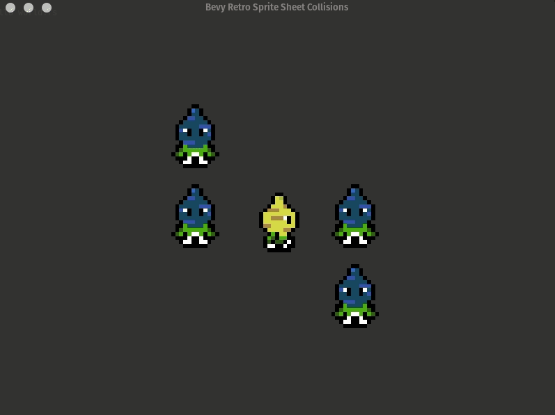

# Bevy Retro Examples

## [hello_world]

A good intro into Bevy Retro that also shows how to use the hierarchy system.

[hello_world]: ./hello_world.rs

## [spritesheet]

An example of how to use animated sprite sheets.

[spritesheet]: ./spritesheet.rs

## [collisions]

An example demonstrating how to detect pixel-perfect collisions between sprites

[collisions]: ./collisions.rs

## [post_processing]

An example demonstrating how to add post-processing, using either the built-in CRT or your own custom shaders.

[post_processing]: ./post_processing.rs

## [radishmark]

A bunnymark style demo that logs frame time diagnostics to the console.

[radishmark]: ./radishmark.rs

## TODO

Examples that we haven't made that we might make later:

- LDtk map example ( move the one from the LDtk plugin here )
- Collisions with a sprite sheet
- Character controller
