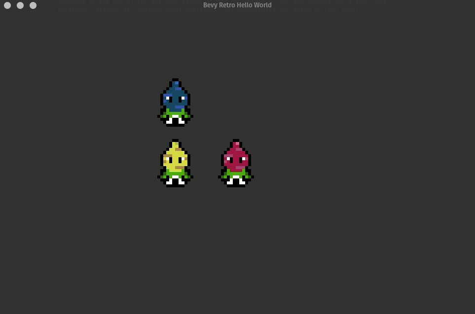
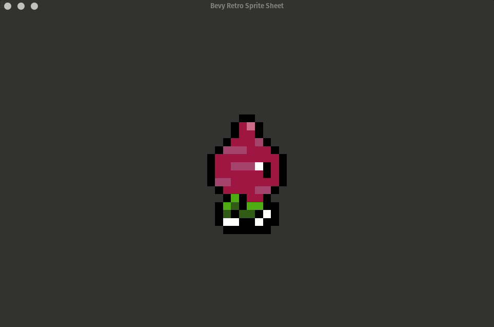
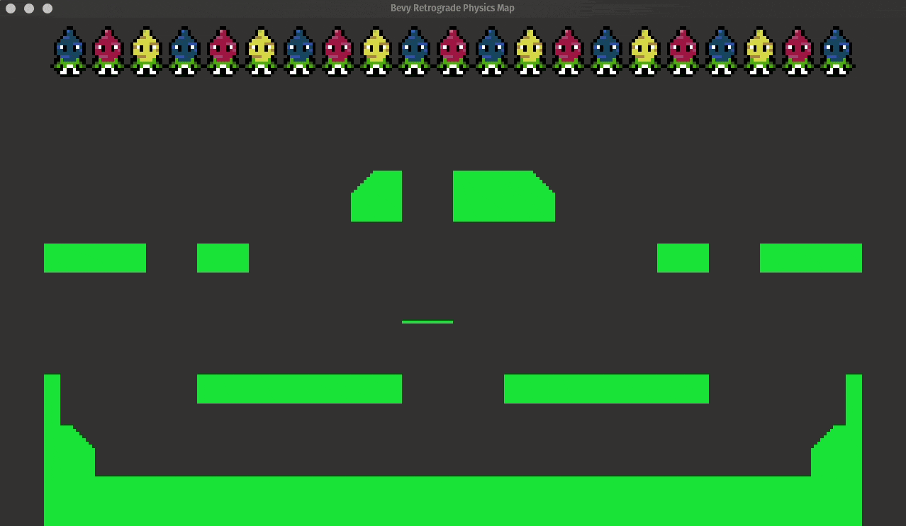
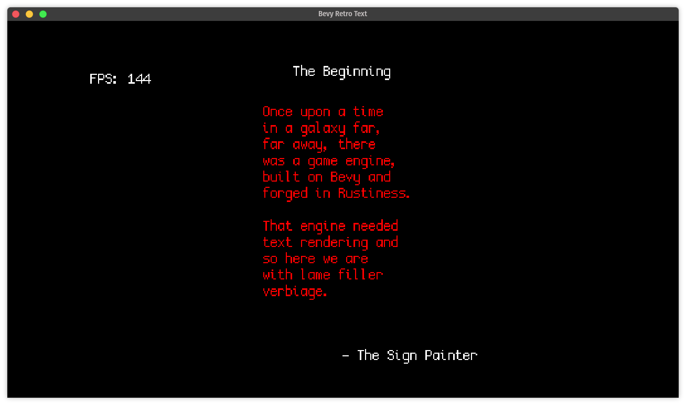
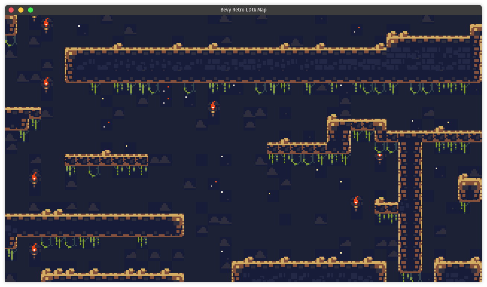
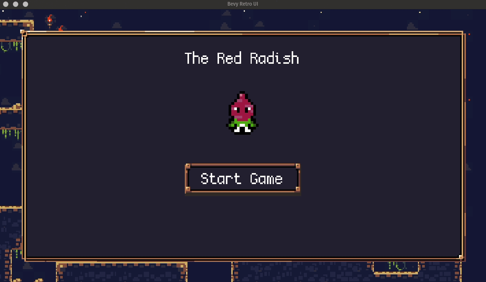
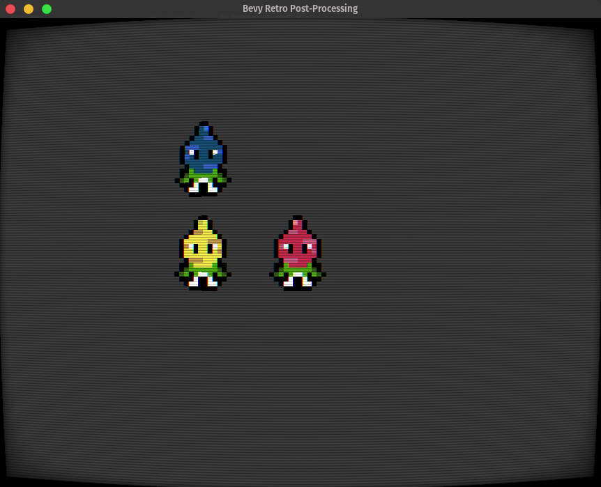
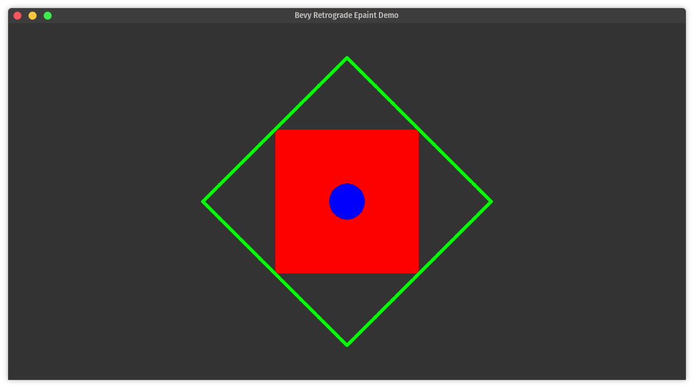
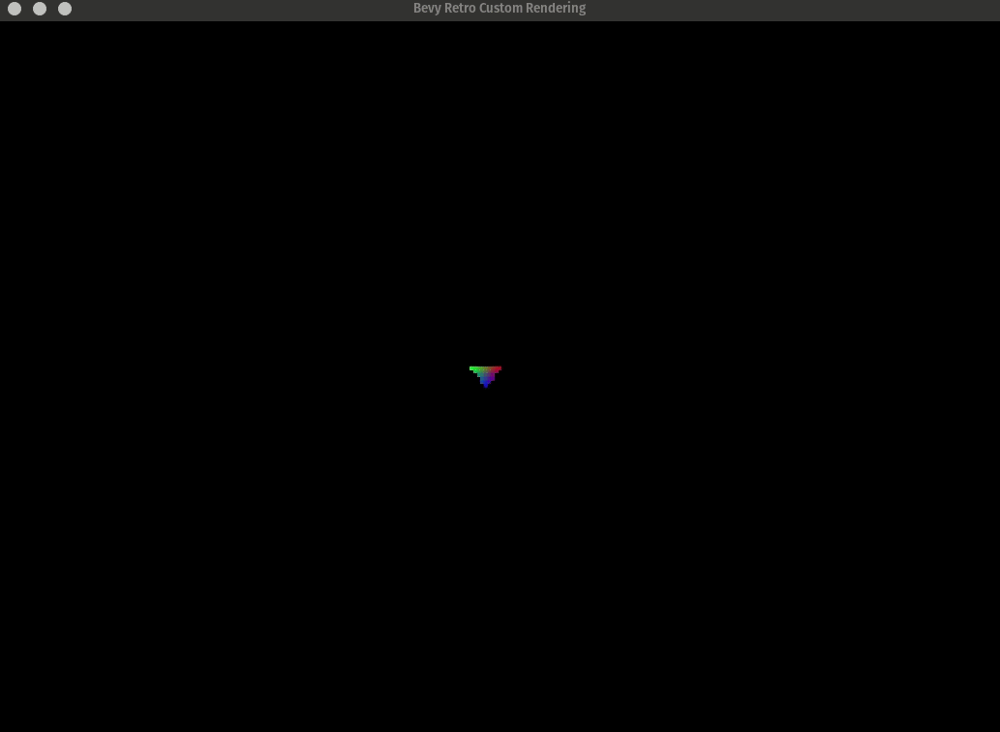

# Bevy Retrograde Examples

## Running Examples

We use the [just] for automating our development tasks and the project `justfile` includes tasks for
running the examples for web or native:

```bash
# Run native example
just run-example audio # or any other example name

# Run web example
just run-example-web collisions

# If you are running a native example you can also just use cargo
# ( this will not work for web examples )
cargo run --example ui
```

When running the web examples it will try to use [`basic-http-server`] to host the example on port
<http://localhost:4000>. You can install [`basic-http-server`] or you can modify the justfile to use
whatever your favorite development http server is.

[just]: https://github.com/casey/just
[`basic-http-server`]: https://github.com/brson/basic-http-server

## Full List

### [hello_world]

A good intro into Bevy Retrograde that also shows how to use the hierarchy system.



[hello_world]: ./hello_world.rs

### [spritesheet]

An example of how to use animated sprite sheets.



[spritesheet]: ./spritesheet.rs

### [physics_character]

An example demonstrating how to use the physics system to create collision boxes from sprites and
how to do simple character movement.


[physics_character]: ./physics_character.rs

### [physics_map]

An example demonstrating how to create collision shapes for an LDtk map.



[physics_map]: ./physics_map.rs

### [text]

An example showing how to render text using BDF font files.

> **Note:** This example shows how to render text, _without_ using the UI system, by creating text
> entities. This doesn't allow you to do any sort of layout other than positioning the text in the
> scene like you would any sprite. See the UI example below to see how to use the UI system to
> render text.



[text]: ./text.rs

### [ldtk_map]

An example showing you how to load and display an LDtk map file.



[ldtk_map]: ./ldtk_map.rs

### [ui]

An example demonstrating the [RAUI] UI integration. It shows how to create UI elements that can
resize with the screen and how to create theme-able buttons and interact with the ECS world from the
UI.

[raui]: https://raui-labs.github.io/raui/



[ui]: ./ui.rs

### [audio]

An example demonstrating how to play sounds and play music on loop.

[audio]: ./audio.rs

### [post_processing]

An example demonstrating how to add post-processing, using either the built-in CRT or your own
custom shaders.



[post_processing]: ./post_processing.rs

### [epaint]

An example demonstrating how to use the [`epaint`](https://docs.rs/epaint) integration to draw
simple shapes for debug rendering.



[epaint]: ./epaint.rs

### [custom_rendering]

An advanced example that shows how to do fully custom rendering of your own objects. This utilizes
raw calls to the [Luminance] graphics API allowing you to render _any_ kind of object, even 3D if
you wanted to.



[luminance]: https://github.com/phaazon/luminance-rs
[custom_rendering]: ./custom_rendering.rs

### [radishmark]

A bunnymark style benchmark that also demonstrates how to use the UI system to render
frames-per-second diagnostics.


[radishmark]: ./radishmark.rs
