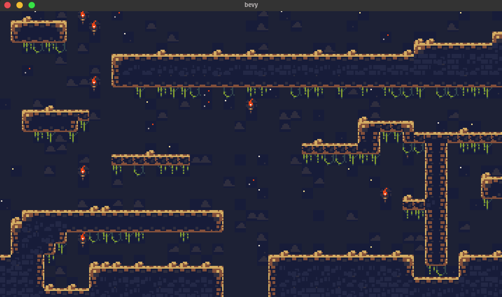

# bevy_retro_ldtk

[](https://crates.io/crates/bevy_ldtk)
[](https://docs.rs/bevy_ldtk)
[](https://github.com/katharostech/katharos-license)



_( Tileset from ["Cavernas"] by Adam Saltsman  )_

["Cavernas"]: https://adamatomic.itch.io/cavernas

A [Bevy Retro][br] plugin for loading [LDtk] tile maps.

[ldtk]: https://github.com/deepnight/ldtk [br]: https://github.com/katharostech/bevy_retro

## Usage

```rust
use bevy::prelude::*;
use bevy_ldtk::*;

fn main() {
    App::build()
        .add_plugins(DefaultPlugins)
        .add_plugin(LdtkPlugin)
        .add_startup_system(setup.system())
        .run();
}

fn setup(commands: &mut Commands, asset_server: Res<AssetServer>) {
    commands
        // Spawn a camera
        .spawn(Camera2dBundle::default())
        // Spawn a map bundle
        .spawn(LdtkMapBundle {
            // Specify the path to the map asset to load
            map: asset_server.load("map1.ldtk"),
            config: LdtkMapConfig {
                // Automatically set the clear color to the LDtk background color
                set_clear_color: true,
                // You can specify a scale or leave it set to 1 for 1 to 1 pixel size
                scale: 3.0,
                // Set which level to load out of the map or leave it to 0 for the default level
                level: 0,
                // Tell the map to center around it's `Transform` instead of putting the top-left
                // corner of the map at the origin `Transform`.
                center_map: true,
            },
            ..Default::default()
        });
}
```

### LDtk Versions

| LDtk Version | Plugin Version |
| ------------ | ---------------|
| 0.8.1        | 0.4            |
| 0.7.0        | 0.2, 0.3       |

### Bevy Versions

| Bevy Version | Plugin Version |
| - | - |
| b17f8a4b | 0.1 ( only unstable bevy for now |

## Caveats

The plugin is in relatively early stages, but it is still rather functional for many basic maps

- Many features are not supported yet, including:
  - tilesets with spacing in them
  - levels in separate files
- Occasionally some slight rendering artifacts between tiles. ( [#1] ) Not sure what causes
  those yet. Help from anybody with rendering experience would be greatly appreciated!

[#1]: https://github.com/katharostech/bevy_ldtk/issues/1

If you run into anything that isn't supported that you want to use in your game open an issue or
PR to help prioritize what gets implemented.

## License

Bevy Retro LDtk is licensed under the [Katharos License][k_license] which places certain
restrictions on what you are allowed to use it for. Please read and understand the terms before
using Bevy LDtk for your project.

[k_license]: https://github.com/katharostech/katharos-license
